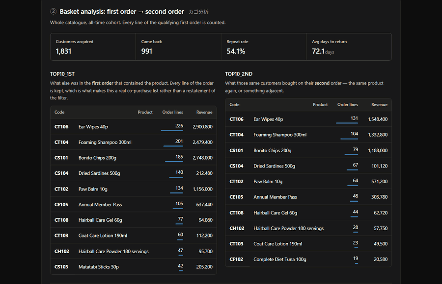
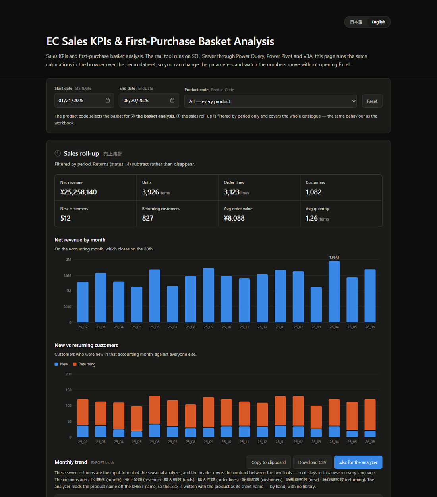
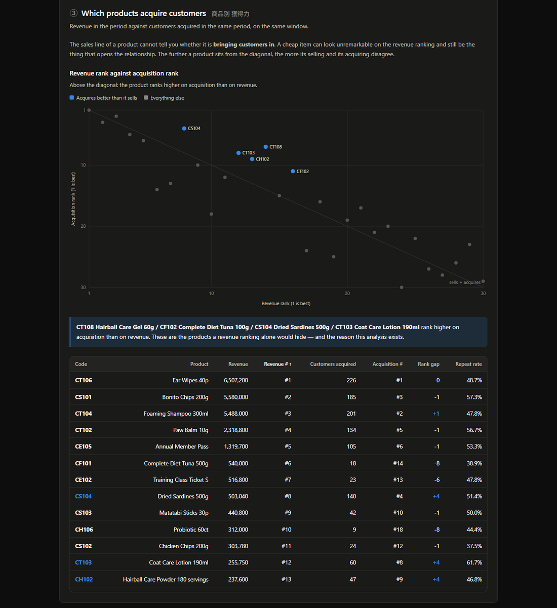

# EC 売上集計 ＆ 初回購入カゴ分析

[](https://github.com/coolcatplayground/basket-sales-analysis/actions/workflows/verify.yml)
&nbsp;·&nbsp; [English](README.md) · **日本語**

### どの商品が「売れているか」ではなく、どの商品が「顧客を連れてくるか」。

勤務先の EC 部門向けに作った Excel ＋ SQL Server の分析ツールを、ブラウザで触れるデモとして
作り直したものです。ある商品を、顧客の**初回購入**から**2回目に何を買ったか**まで追いかけます
——商品自身の売上ラインでは答えられない問いです。

**[▶ ライブデモを開く](https://coolcatplayground.github.io/basket-sales-analysis/?lang=ja)**
——Excel も、データベースも、ログインも不要です。日本語／英語対応。



|  |  |
|---|---|
| **課題** | 売上に関する問いはすべて手書きクエリが必要で、質問と答えの間に必ず専門家が挟まり、結局だれも聞かなくなっていた。 |
| **作ったもの** | 集計を SQL Server 側に押し下げたパラメータ化 KPI と、対象伝票の全明細を保持する初回購入カゴ分析。 |
| **変わったこと** | 「聞くコスト」が下がり、実際に聞かれるようになった。出力はそのまま、季節性を分析する別ツールの入力になっている。 |

デモデータでは、この主張が具体的な形で出てきます。**CT108 毛玉ケアジェル 60g は売上順位14位、
獲得顧客数では7位。** 売上レポートだけを見ていれば二度見することのない商品ですが、連れてきた顧客の
およそ半分が戻ってきています。この差こそ、このツールが商品の売上ラインではなく顧客の初回購入から
追いかける理由であり、
[実際に確かめられます](https://coolcatplayground.github.io/basket-sales-analysis/?lang=ja&product=CT108)
——パラメータは URL に入っているからです。





> **このリポジトリに会社のデータは一切含まれません。** これは社内 SQL Server 上で動くツールの
> 解説であり、触れるものはすべて合成データで動いています。実際の売上・顧客数・商品コードは公開して
> おらず、サーバー名・データベース名・ファイルパス・ベンダーのテーブル名はプレースホルダに置き換えて
> あります。

---

## 課題

データはあるのに、それに問いを投げる手段がありませんでした。

受注履歴は SQL Server にありました。そこから何かを取り出すには Access を開いて手でクエリを書く
必要があり、つまりスキーマを知っていて、どのステータスを数えるかを知っていて、月度の切り方を知って
いる必要がありました。実務上これは、あらゆる問いと答えの間に専門家が一人挟まることを意味し、小さな
問いのコストが大きな問いとほぼ同じになることを意味しました。定常レポートを作った人はいませんでした
——作ること自体が丸ごと一仕事だったからです。

そこから 2 つの異なるニーズが出てきました。

**素早い売上数値（KPI1）。** 誰かのクエリを経由せずに、その月の売上・数量・顧客の内訳が欲しい。
求められていたのは高度さではなく速さでした——その日の午後には動ける数字です。

**顧客行動（KPI2）。** 同僚が、商品が実際にどう効いているかを調べたいと言い出しました。これは
1 つの問いではなく、問いの連鎖でした。

1. この商品は、ある期間に通常のベースラインを超えて跳ねたか？
2. 跳ねたとして、それは*新規*顧客を連れてきたのか、既存顧客により多く売れただけなのか？
3. 新規顧客を連れてきたとして、そのうち戻ってきた人はいるか？
4. 戻ってきたとして——**2回目に何を買ったのか？** 同じ商品か、それとも隣の棚か？

最後の問いが、このツールが存在する理由です。商品自身の売上ラインでは答えられません。安い商品が
売上ランキングでは平凡に見えたまま、関係の入口になり、数週間後に高額な商品へ顧客を引き戻している
——既存のレポートでは、この 2 つのケースを区別できませんでした。

## できること

**KPI1 — 売上集計。** 任意の期間・任意の商品（または全商品）について、返品差引後の売上金額、
購入個数、購入件数、実顧客数、新規／既存の内訳。期間合計に加えて月別推移も出します。

**KPI2 — 初回購入カゴ分析。** 商品コードを渡すと、*初回購入*にその商品が入っていた顧客をすべて
洗い出し、次を返します。

| 出力 | 答えている問い |
|---|---|
| 初回購入顧客数 | この商品は何人の顧客を獲得したか？ |
| リピート率 | そのうち何割が2回目に来たか？ |
| 平均リピート日数 | どれくらいの期間で戻ってきたか？ |
| **TOP10_1ST** | その初回購入の伝票に、他に何が入っていたか？ |
| **TOP10_2ND** | その顧客たちは*2回目*に何を買ったか？ |

2 つの TOP10 表が本題です。`TOP10_1ST` が本物の併売リストになるのは、フィルタに一致した明細だけ
でなく**対象伝票の全明細**を保持しているからです。`TOP10_2ND` はリピートの問いに直接答えます
——同じ商品に戻ったのか、関連商品に移ったのか。

結果は登録月度コホート別に分解されます。商品の獲得実績は、その顧客が実際に入会した月に対して読む
ものであり、10年分の履歴に均してしまうと意味が消えるからです。

**3つ目のビュー（ブラウザデモのみ）。** KPI1 も KPI2 も一度に1商品しか答えません。つまり、この
ツールが立脚している主張——商品の売上ラインではその商品が顧客を獲得しているか分からない——を
確かめるには、商品を1つずつ見ていくしかありませんでした。デモにはワークブックにないビューを足して
あります。全商品を売上と獲得顧客数の両方で順位づけし、順位対順位でプロットしたものです。対角線から
の距離がすべてで、対角線より上にある商品こそ、売上ランキングが隠してしまう商品です。新しい定義は
持ち込んでいません——獲得の判定はワークブック自身の MEMBERS!K と同じで、数値は商品ごとに回した
場合の結果と突き合わせて検証しています。

## 仕組み

```
SQL Server（受注データベース、約10年分）
    │
    │  Value.NativeQuery — 集計をサーバー側に押し下げる
    ▼
Power Query (M)  ←── パラメータはシート側から読み戻す (tblParameter)
    │
    ├─→ 小さい結果セット  ─→ ワークシート表 ─→ ダッシュボード
    └─→ 大きいファクト表  ─→ Power Pivot データモデル
    │
    ▼
VBA: 速いグループと遅いグループを別々のボタンで更新
```

パラメータ——開始日・終了日・商品コード——はダッシュボード上の表に置いてあります。Power Query が
それをシートから読み戻すので、セルを変えれば送信される SQL が変わります。問いを変えるのにクエリを
触る必要はありません。

作りを決めた判断が 3 つあります。

**集計はサーバー側に押し下げる。** 最初の版は受注明細を Power Query に引き込んでそこで集計して
いました。動きはしましたが、実用にならないほど遅かった。`KPI1_SUMMARY` と `KPI1_MONTHLY` を
`Value.NativeQuery` に書き直し、`GROUP BY` を SQL Server にやらせて数百万行ではなく数行だけ
返すようにしました。日付フィルタも、まだクエリフォールディングが効くうちに、結合の*前*に明細表へ
当てています。

**受注ステータスのフィルタは結合の後にしか置けない。** ステータスは明細ではなく受注ヘッダ側に
あるので、ヘッダ結合が済むまでステータスフィルタは走らせられません。ここの順序を間違えると、
エラーにならずに黙って行が落ちます——もっともらしい数字が出てしまう種類のバグです。

**更新を分ける。** KPI1 は数秒で返ります。KPI2 は全顧客の購買履歴を歩くので、条件によって
**2〜20分**かかります。今月の売上だけ見たい人がコホート処理に人質に取られないよう、別々のボタンに
分けました。ダッシュボードにも、遅いボタンのすぐ隣に平文でそう書いてあります。

## ツールに埋め込まれた業務ルール

**月度は暦月ではない。** 会計月は20日締めなので、21日の売上は*翌月*に入ります。

```
月度 = if DAY(売上日) >= 21 then month(売上日) + 1 else month(売上日)
```

同じ規則を顧客の登録日にも当て、両者を突き合わせて*その月における*新規／既存を判定します。ひとつ
はっきり書いておくべき帰結があります。同じ人物がある月には「新規」、別の月には「既存」になり得る
ため、長い期間では 新規 + 既存 ≠ 実顧客数 になります。これは不具合ではなく正しい挙動ですが、
出力を初めて見る人が最初に引っかかる点なので、明示しておく必要があります。

**売上は返品差引後。** ステータス `11` が完了、`14` が返品。除外ではなく符号を付けて合算するので、
返品は消えるのではなく引かれます。

```sql
SUM(CASE WHEN 受注ステータス='11' THEN 商品売価計
         WHEN 受注ステータス='14' THEN -商品売価計 ELSE 0 END)
```

**購入順位は顧客ごと、完了受注のみで採番。**
`ROW_NUMBER() OVER (PARTITION BY 会員ID ORDER BY 売上日, 受注伝票番号)` で各顧客の初回・2回目を
特定します。キャンセルされた受注は順位を消費しません。

**「初回購入のカゴ」は伝票まるごと。** 上に書いたとおりで、これが併売表をフィルタの言い換えでは
なく情報にしている理由です。

## 規模

- 受注履歴およそ **10年分**
- 月あたり **約25,000明細**、合計で **300万行超**
- 商品数はおよそ **700〜800**
- KPI1 の更新：数秒。KPI2 の更新：2〜20分。

## 何が変わったか

ひとつの大きな意思決定を生んだというより、売上データの使われ方が変わりました。

その月の売上が必要な人は、手書きの Access クエリの順番待ちをせずに自分で引けるようになりました。
もっと細かく見たければ、クエリはすでに組んであってパラメータ化されているので、SQL を書くのでは
なくセルを変えるだけです。効果は「あるレポートが速くなった」ことよりも、「聞くコストが下がって、
実際に聞かれるようになった」ことにあります。

最も使っているのは **企画部**で、出力は下流にも流れています。同じデータが、別途作った季節性
分析ツール（商品の需要が年間でどう動くかをモデル化するもの）を動かしています。

## 月別推移の表は「連携仕様」

月別推移のブロックは単なる表示ではありません。この 7 列がそのまま **Sales Ledger** 季節性
アナライザーの入力形式です。2つ目のツールはこのツールの出力の上に作られているので、ヘッダー行は
両者の契約になっています。

| 月別推移 | 売上金額 | 購入個数 | 購入件数 | 総顧客数 | 新規顧客数 | 既存顧客数 |
|---|---|---|---|---|---|---|
| 25_04 | 1294060 | 223 | 179 | 121 | 36 | 85 |

運用の流れは、ここで商品と期間を指定し、ブロックを商品名を付けたシートにコピーして保存し、
アナライザーに投げる、というものです。シート名がそのまま商品名になり、アナライザー側は年月で
マージするので、履歴を丸ごと再出力しても問題ありません。

デモのワークブックにはこの形どおりの `EXPORT` シートがあり、ブラウザデモにも同じブロックを
クリップボードコピーと CSV のボタン付きで載せてあるので、Excel を開かずに連携を追えます。この 7 つの
ヘッダーは、言語切り替えが唯一手を付けない場所です——アナライザーが解釈するには完全一致が必要な
ので、どちらの言語でも日本語のままにし、英語表示では訳を添えるだけにしています。

ただし CSV ではこの連携は完結しません。アナライザーは `.xlsx` を読み、商品名を**シート名**から
取るため、シート名自体が受け渡しの中身の一部です。そこでデモは本物の `.xlsx` を書き出します
——XML パーツを詰めた zip を、ライブラリなしで手で組み立てています。1シート出力するために表計算
ライブラリを読み込むページでは、話の筋が通らないからです。`tools/verify.py` が毎プッシュで本物の
表計算リーダーを使って開き、シート名・7つのヘッダー・セルの型を確認します。連携は端から端まで検証
済みで、アナライザーのパーサーは 7 列すべてを解決し、統計エンジンは無改修でそのまま分析します。

## リポジトリの中身

| パス | 中身 |
|---|---|
| `index.html`, `css/style.css` | ブラウザデモ——静的1ページ、フレームワークもビルドも無し |
| `js/kpi.js` | 計算エンジン。ワークブックから列単位で移植 |
| `js/charts.js` | 2つの SVG チャート。依存を持たないよう手書き |
| `js/app.js` | パラメータ、描画、EXPORT ブロック、URL 状態 |
| `js/i18n.js` | 日本語・英語の文言と言語切り替え |
| `js/xlsx.js` | 最小限の `.xlsx` ライター——zip と XML を手書き、ライブラリ無し |
| `tools/` | 検証スイート：`python tools/verify.py` |
| `LICENSE` | MIT |
| `.github/workflows/verify.yml` | 毎プッシュでスイートを実行 |
| `docs/` | 上に貼ってあるスクリーンショットと GIF |
| `EC_Sales_Basket_Analysis_Demo.xlsx` | 同じロジックをワークシート数式でローカル表に対して実装したもの |
| `data/orders_demo.csv` | 合成データ——6,824明細、1,900顧客、4,106伝票 |
| `data/products_demo.csv` | 商品マスタ——30商品、デモページ用の英語名付き |

本番レイヤー——Power Query (M) のセクション、そこから送る native T-SQL、更新用の VBA マクロ
——はここには公開していません。社内 SQL Server に対して動くものであり、この README では単体で
読める断片だけを引用しています。

どちらのデモもデータベースや資格情報なしで上記のロジックを再現しており、出力は同じ仕様の独立実装と
突き合わせて検証しています。

### デモのカタログ

合成データは架空の猫用品店です——ケア・フード・健康・おやつ・サービスの 30 商品
（`CT` / `CF` / `CH` / `CS` / `CE`）で、季節性アナライザー側の猫カタログと揃えてあります。
2つのツールが無関係なデータセットではなく、ひとつのポートフォリオとして読めるようにするためです。
いくつかの商品は 2 サイズで用意してあり（`CT101` / `CT102` の肉球バーム、`CF101` / `CF102` の
まぐろ総合栄養食）、これが併売表に語るべき中身を与えています。

数値はラベルに一切依存しません。カタログの改名はコードと名称の全単射として行い、あらゆる数値
——サマリ指標、月次の全行、コホートの全行、両方の TOP10 表——を 8 通りのパラメータで、その対応の
下で完全に一致することを確認しています。

### ブラウザデモの動かし方

上のライブリンクを開くか、ローカルで配信してください。`file://` では `fetch` がブロックされるため、
ダブルクリックではなくサーバーが必要です。

```bash
python3 -m http.server 8000
```

### Excel ワークブックの動かし方

開いて **DASHBOARD** シートの 3 セルを編集するだけで、あとは全部再計算されます。マクロも接続も
資格情報も不要です。

| セル | パラメータ | 形式 |
|---|---|---|
| `C6` | StartDate | `YYYYMMDD`（例 `20250121`） |
| `C7` | EndDate | `YYYYMMDD`（例 `20260620`） |
| `C8` | 商品コード | `CT106` のような商品コード、または全商品なら `All` |

背後のシート：`KPI1_SUMMARY` / `KPI1_MONTHLY`（売上集計と月別推移）、`KPI2_SUMMARY`（初回購入
コホート）、`TOP10_1ST` / `TOP10_2ND`（2つの併売表）、`EXPORT`（7列の連携ブロック）、そして
`DATA_ORDERS` / `MEMBERS` / `PRODUCTS`（合成データと行ごとの作業列）。

このファイルは Excel が保存したものではなく生成物なので、開いたときに全再計算するフラグを付けて
あります。もし空欄が見えるビューアがあれば、`Ctrl+Alt+F9` で同じ計算を強制できます。

### どう検証しているか

    python tools/verify.py

5 つのチェックを、手元でも CI でも毎プッシュ実行しています。

**エンジン対 独立実装。** `js/kpi.js` はワークブックの列単位の移植で、各ブロックに由来のシート名と
列名を書いてあるので、2つを並べて読めます。移植を検証するために、同じ仕様を Python でもう一度
（`tools/reference_impl.py`）、あえて逆向きに実装しました。ワークブック（したがって JS）が行相対の
累積カウンタで顧客の初出を判定するのに対し、リファレンス側は集合の要素数として同じ量を求めます。
両者を 10 通りのパラメータ——全商品と単一商品、広い期間と狭い期間、受注が1件もない期間、1日だけの
期間、20日をまたぐ期間——で、ページ上のあらゆる数値について比較しています。サマリ指標8つ、月次の
全行、コホート123行、両方の TOP10 表。すべて完全一致します。

**商品スキャン対 愚直な方法。** ③ は初回購入伝票を1回走査してカゴ内の全商品にクレジットする方式で、
コホート処理を30回まわしていません。この近道は同じ数値に着地して初めて正当なので、
`tools/check_product_scan.js` が商品ごとに `compute()` と突き合わせています。

**月次の行 対 ワークブックの数式。** 月別推移ブロックにどの月が入るかは細部ではなく契約です
——アナライザーが受け取るものそのものだからです。`tools/check_month_rows.js` が、21日始まり、
単一月度に収まる期間、シートの36行上限を超える期間を含む 7 通りについて、先頭月・末尾月・行数を
固定しています。期待値はエンジンからではなく `CONFIG!B4`/`B5` と `KPI1_MONTHLY!An` から手で
起こしました。そこが肝で、以前の移植はこのブロックを月度ではなく暦月から採番していて全行が1つ
ずれており、Python リファレンスも同じ読み違いから書かれていたため、両者は完全に一致していました。
ワークブックから書いたチェックだけが、これを捕まえられます。

**書き出し 対 アナライザーの契約。** 手書きの `.xlsx` を `openpyxl` で開き、シート名・7つの
ヘッダー文字列・数値セルの型を確認します。

**ページそのもの。** ここまでは算術の正しさしか証明しません。要素 id の改名やロード時に投げる
スクリプトは、どれにも引っかかりません。`tools/smoke_test.py` はフォルダを配信し、ヘッドレス
Chrome で各言語で開き、描画後の DOM に対して検証します——数値、チャートのマーク、表の行、そして
ページ自身のエラーバナーが出ていないこと。自動化ライブラリは使いません。Chrome の `--dump-dom` が
スクリプト実行後の DOM を出力してくれます。

### 知っておくべき挙動が1つ

**①売上集計は商品コードでフィルタしません。** 商品コードは②のカゴの対象を決めるもので、集計の方は
全商品に対する期間フィルタです。ダッシュボード自身の説明もそう書いてあり、商品を選んでも上段の数値が
変わらないのはこのためです。デモはこれを修正せず再現しています——ワークブックが仕様だからです。

## サニタイズ

社内版から削除・置換したもの：埋め込みデータモデル（本番受注テーブルのコピー）、実際の数値と商品
識別子、SQL Server のホスト名とデータベース名（→ `<SQL_SERVER>` / `<ORDER_DB>`）、商品マスタへの
社内ファイル共有パス、ベンダーの物理テーブル名（→ `T_ORDER_DETAIL`, `T_ORDER_HEADER`,
`T_MEMBER`, `T_PRODUCT`）。

日本語の業務カラム名（`売上日`, `商品コード`, `会員ID`）はそのまま残しています——EC では一般的な
語であり、クエリもその方が読みやすいためです。

---

**技術スタック:** SQL Server · Power Query (M) · Power Pivot · VBA · Excel
