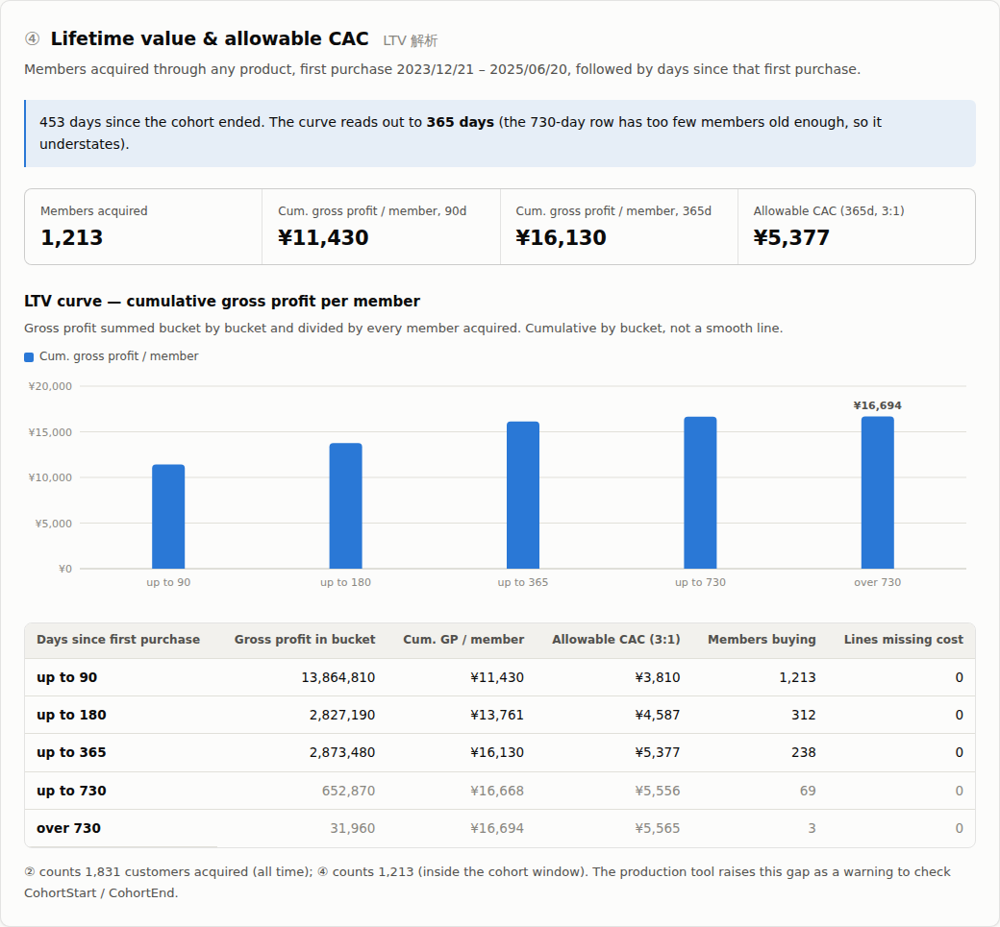

# EC Sales KPI & First-Purchase Basket Analysis

### Which products bring customers in, not just which ones sell.

A sales analysis tool built for the e-commerce team at my workplace, rebuilt here as a browser demo with a fictional cat-supply store. It follows a customer from their **first ever order** to what they bought the **second** time. A product's own sales chart can't tell you that.

**[▶ Open the live demo](https://coolcatplayground.github.io/basket-sales-analysis/)** — no Excel, no database, no sign-in. Japanese and English.

---

## Field notes: the creature in the wild

The company had ten years of order history and no easy way to ask it anything. Every question meant a hand-written database query, so a specialist stood between each question and its answer. Small questions cost as much as big ones, so mostly, nobody asked.

A colleague wanted to know how products actually behave, which turned out to be a chain of questions:

1. Did this product sell unusually well in a certain period?
2. If so, did it bring in **new** customers, or just sell more to existing ones?
3. Did any of those new customers come back?
4. And if they came back, **what did they buy the second time?**

That last question is the reason this tool exists.

## What it does

**Sales at a glance.** Pick a period and one or more products, and get revenue, units, customers, and the new-versus-returning split, month by month. Change a cell, not a query.

**First-purchase basket analysis.** Pick a product (or several), and the tool finds every customer whose first order included it. Then it reports:

- how many customers that product brought in
- how many came back, and how long they took (average, median and fastest)
- what else was in that first order
- what they bought on their second order

**How fast they come back.** Repeat rates within 30, 90, 180, 365 and 730 days. Each band only counts customers who've been around long enough to be judged, so last month's newcomers don't drag the 365-day rate down just for being new.

**What a customer is worth.** The LTV curve follows a group of customers from their first purchase and adds up the gross profit they bring in over time, per customer. A third of that is the most you can spend to win one new customer and still keep a healthy 3:1 return. The tool also says how far along the curve the group is old enough to be trusted.

**Every product side by side** *(browser demo only).* All products ranked on revenue and on customers acquired, plotted against each other. The products that sit far from the diagonal are the ones a revenue ranking hides.

## Worth a closer look: specimen CT108

In the demo data, **CT108 毛玉ケアジェル 60g ranks 14th on revenue but 7th on customers acquired**, and roughly half the customers it brings in come back. On a revenue report, nobody would look at it twice. This tool is built to catch exactly that kind of quiet achiever.

[See it for yourself →](https://coolcatplayground.github.io/basket-sales-analysis/?product=CT108)

## Local customs it respects

- **The month isn't the calendar month.** The company's accounting month closes on the 20th, so a sale on the 21st belongs to next month. The tool follows the accounting calendar, not the wall calendar.
- **Returns count as minus, not missing.** Returned orders are subtracted from revenue instead of quietly disappearing.
- **"New" depends on the month.** The same person can be a new customer one month and a returning customer the next. That looks like a bug the first time you see it. It isn't.
- **Lifetime value means profit, not sales.** Revenue minus product cost. A customer who never came back still counts in the average, because winning them still cost something.

## What changed

The cost of asking dropped far enough that people started asking. Monthly sales now come out in seconds instead of waiting on someone's query, and the deeper analysis is a button press away.

The heaviest users have been the **企画 (product planning) department**. The monthly output also feeds a second tool, the [seasonal analyzer](https://github.com/coolcatplayground/seasonal-analyzer), which asks whether a product's good months come from the season or from a campaign.

**Scale in the wild:** about ten years of orders, 3 million+ order lines and 700–800 products. Quick figures refresh in seconds; the full customer analysis takes 2–20 minutes, so it sits behind its own button.

## Construction

The tool has grown in versions. Version 3 added multiple products, repeat-time bands and the LTV curve, which answers a very practical question: *how much can we afford to spend to win a customer?*

The problem, the questions and the business rules came from the job. The original tool runs on Excel and SQL Server inside the company. This public demo was built with generative AI under my direction, and every figure on the page is checked automatically against a second, independent calculation each time the code changes.

## Fine print

**No company data appears in this repository.** Everything you can click on runs on a fictional cat-supply store: 30 products, 1,900 customers and about 6,800 order lines, all made up. No real revenue, customer counts or product codes are published, and server names, database names and file paths are replaced with placeholders.

Product costs in the demo are invented too.

What's inside: the browser demo (`index.html`, all version 3 features), a demo Excel workbook with the core version 2 logic (`EC_Sales_Basket_Analysis_Demo.xlsx`), the fictional data (`data/`) and the automatic checks (`tools/`). MIT licensed.
